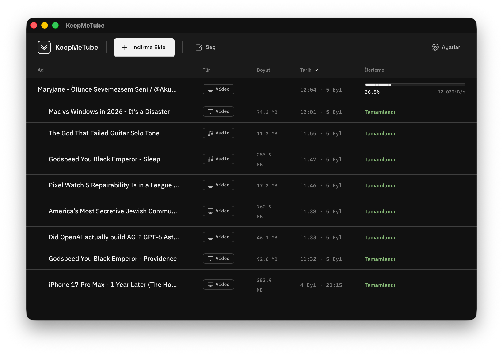
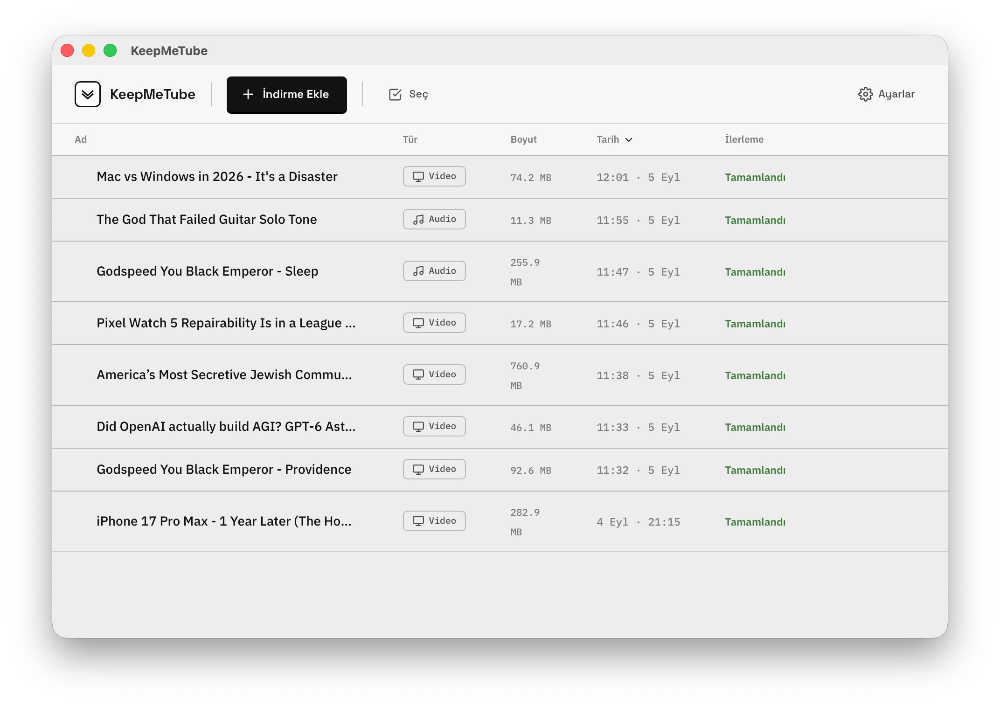
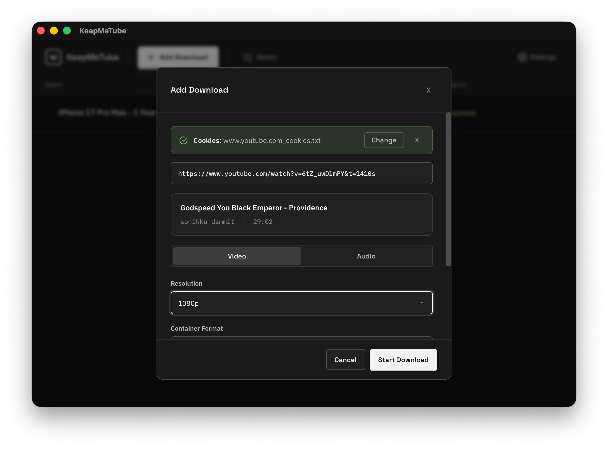
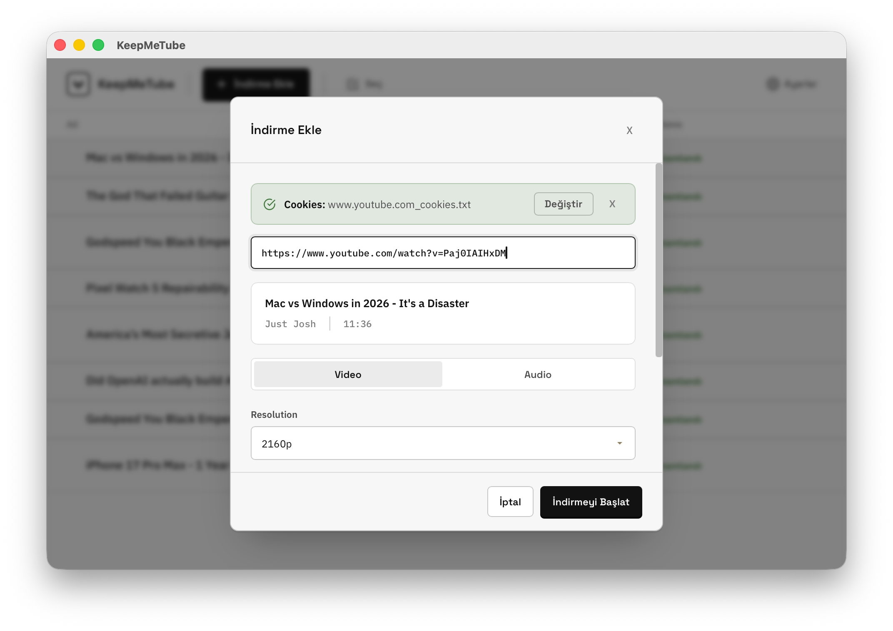

# KeepMeTube

A modern, fast, and cross-platform desktop application for downloading videos and audio from **YouTube, Instagram, Twitch, TikTok, Twitter/X, Reddit, Facebook, Vimeo, SoundCloud, and [1800+ other websites](https://github.com/yt-dlp/yt-dlp/blob/master/supportedsites.md)**.

Powered by [yt-dlp](https://github.com/yt-dlp/yt-dlp) and built with [Tauri v2](https://tauri.app/) (Rust backend) and React + TypeScript + Tailwind CSS (frontend).

---

## Screenshots

<table>
  <tr>
    <td width="50%">
      
      <p align="center"><sub>Download queue — dark theme, live progress</sub></p>
    </td>
    <td width="50%">
      
      <p align="center"><sub>Download queue — light theme</sub></p>
    </td>
  </tr>
  <tr>
    <td width="50%">
      
      <p align="center"><sub>Add Download — resolution, format, and cookie authentication</sub></p>
    </td>
    <td width="50%">
      
      <p align="center"><sub>Add Download — light theme</sub></p>
    </td>
  </tr>
</table>

More screenshots are available in the [screenshots](screenshots) folder.

---

## Download

**[Get the latest release (macOS, Windows, Linux)](https://github.com/Tetracon05/KeepMeTube/releases)**

### Note for macOS: fixing the "damaged application" warning

The first time you open KeepMeTube, macOS may claim the app "is damaged and can't be opened," even though nothing is wrong with it.

**Why this happens**

macOS tags anything downloaded from the internet with a quarantine attribute as a safety measure against accidentally running malicious software. Because KeepMeTube isn't notarized by Apple yet (notarization requires an Apple Developer Program membership), macOS treats it as untrusted by default. The warning is misleading — the app itself is fine.

**How to fix it**

Run this command in Terminal, then press Enter:

```bash
xattr -d com.apple.quarantine "/Applications/KeepMeTube.app"
```

This removes the quarantine flag so the app opens normally from then on.

**Is it safe?** Yes. The command only removes the quarantine mark on this specific app — it doesn't modify KeepMeTube itself or disable any other macOS security feature.

**Alternative: right-click to open**

Right-click KeepMeTube in Finder, choose **Open**, then confirm **Open** in the dialog. This bypasses the warning once but will reappear on the next launch; the Terminal command above is the permanent fix.

---

## Supported Sites

Although named **KeepMeTube**, the application relies on yt-dlp's universal extractor engine and supports **over 1,800 websites and platforms**, including:

| Platform | Supported Content |
| :--- | :--- |
| **YouTube** | Videos, Shorts, Playlists, Audio-only streams (up to 4K/8K) |
| **Instagram** | Reels, Stories, Posts, IGTV |
| **Twitch** | Clips, Full VODs, Highlights |
| **TikTok** | Videos, Audio tracks (with or without watermark) |
| **Twitter / X** | Video tweets, GIFs |
| **Reddit** | Hosted video posts with merged audio |
| **Facebook** | Public & shared video posts, Reels |
| **SoundCloud** | High-quality music tracks, Sets |
| **Vimeo** | HD & 4K video streams |
| **Bilibili / Dailymotion / Pinterest** | Full video downloads |
| **+1800 more platforms** | [Full list of supported extractors](https://github.com/yt-dlp/yt-dlp/blob/master/supportedsites.md) |

---

## Features

- **1,800+ sites supported** — download videos, clips, reels, and audio from nearly anywhere yt-dlp reaches.
- **Always current** — checks for yt-dlp updates on launch and upgrades in one click, so new sites and formats keep working.
- **Cookie authentication (cookies.txt)** — attach a cookies file to pull age-restricted, member-only, or private content using your own logged-in session.
- **10 languages built in** — English, Türkçe, Español, Français, Deutsch, Português, العربية, 日本語, 한국어, and 中文.
- **Settings drawer** — manage cookies, appearance, and language from one place.
- **Live progress** — real percentage, transfer speed, and status for every download, updating as it happens.
- **Light, dark, or system theme** — matches your OS automatically, or set it yourself.
- **File operations built in** — reveal downloads in Finder, Explorer, or your Linux file manager, rename them, or manage history without leaving the app.
- **Smart queue** — up to 3 downloads run at once; the rest wait their turn automatically.
- **History that sticks** — the download list survives app restarts.
- **Dependency auto-detection** — checks for `yt-dlp` and `ffmpeg` on first launch and offers one-click installation.

---

## Authentication & High-Quality Downloads (cookies.txt)

### Why is this needed?

Most public videos on YouTube, Instagram, and Twitch download fine without authentication. But for **age-restricted (18+) videos, member-only streams, private accounts, or high-tier formats**, passing a `cookies.txt` file authenticates your session as a real logged-in user.

### How to get your `cookies.txt`

1. **Install a browser extension:**
   - **Chrome / Edge / Brave / Opera:** [Get cookies.txt locally (Chrome Web Store)](https://chromewebstore.google.com/detail/get-cookiestxt-locally/cclelndahbckbenkjhflpdbgdldlbecc)
   - **Firefox:** [cookies.txt (Firefox Add-ons)](https://addons.mozilla.org/firefox/addon/cookies-txt/)
2. **Log in to the website:** open your browser and sign in to the account you want to use (e.g. YouTube, Instagram).
3. **Export cookies:** click the extension icon, choose **Export** / **Download**, and save the file as `cookies.txt`.
4. **Select it in KeepMeTube:** open **Settings** or use the banner inside the **Add Download** modal, click **Select cookies.txt**, and choose your file. The path is saved automatically — you only need to select it once.

---

## Prerequisites

### Required System Tools

The app requires two external tools. On first launch, it checks for these and offers to install them:

- **yt-dlp** — the video & audio downloader engine
- **ffmpeg** — required for merging video + audio streams and format conversion

### Development Tools

- **Rust** (1.70+) — [Install via rustup](https://rustup.rs/)
- **Node.js** (18+) — [Download](https://nodejs.org/)
- **npm** (9+) — comes with Node.js

### Platform-Specific Requirements

#### macOS
- Xcode Command Line Tools: `xcode-select --install`
- Homebrew (recommended): [brew.sh](https://brew.sh/)

#### Windows
- [WebView2 Runtime](https://developer.microsoft.com/en-us/microsoft-edge/webview2/) (usually pre-installed on Windows 10/11)
- [Build Tools for Visual Studio](https://visualstudio.microsoft.com/visual-cpp-build-tools/)

#### Linux
- `webkit2gtk-4.1` and related libraries:
  ```bash
  # Debian/Ubuntu
  sudo apt install libwebkit2gtk-4.1-dev build-essential curl wget file libxdo-dev libssl-dev libayatana-appindicator3-dev librsvg2-dev

  # Fedora
  sudo dnf install webkit2gtk4.1-devel openssl-devel curl wget file libappindicator-gtk3-devel librsvg2-devel
  ```

---

## Build Steps

### 1. Install Dependencies

```bash
npm install
```

### 2. Development Mode

```bash
npm run tauri dev
```

This starts both the Vite dev server (frontend HMR) and the Tauri Rust backend.

### 3. Production Build

```bash
npm run tauri build
```

This produces platform-specific installer bundles:

| Platform | Output |
| :--- | :--- |
| **macOS** | `src-tauri/target/release/bundle/dmg/KeepMeTube.dmg` |
| **Windows** | `src-tauri/target/release/bundle/msi/KeepMeTube.msi` |
| **Linux** | `src-tauri/target/release/bundle/appimage/KeepMeTube.AppImage` |

---

## Installing yt-dlp and ffmpeg Manually

### macOS (Homebrew)
```bash
brew install yt-dlp ffmpeg
```

### Windows (winget)
```bash
winget install yt-dlp.yt-dlp
winget install Gyan.FFmpeg
```

### Linux
```bash
# yt-dlp
pip3 install yt-dlp

# ffmpeg
sudo apt install ffmpeg      # Debian/Ubuntu
sudo dnf install ffmpeg      # Fedora
sudo pacman -S ffmpeg        # Arch
```

---

## Architecture

```
├── src/                    # React Frontend (TypeScript)
│   ├── components/         # UI Components (Download List, Modals, Settings, Dialogs)
│   ├── store/              # Zustand state management
│   ├── hooks/              # Custom React hooks (Language, Theme, ContextMenu)
│   ├── lib/                # API wrappers (Tauri IPC), i18n, utils
│   └── types/               # TypeScript type definitions
├── src-tauri/              # Rust Backend (Tauri v2)
│   └── src/
│       ├── commands/       # Tauri command handlers (Download, Analyze, Dependencies, File Ops)
│       ├── state.rs        # App state types
│       └── store.rs        # JSON persistence & configuration
```

---

## License

MIT
